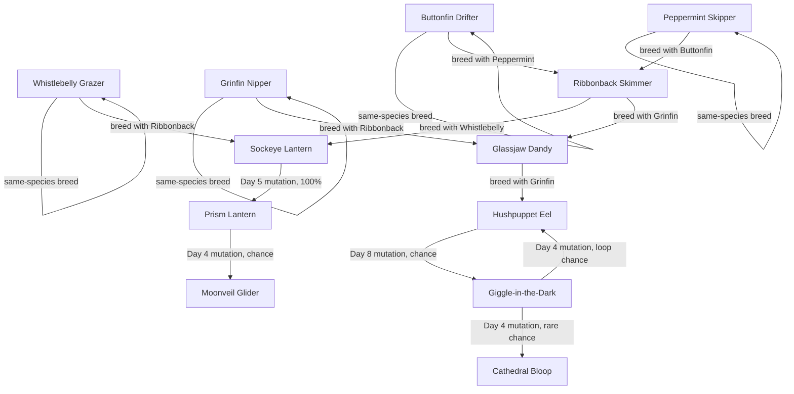

# XenoReef Initial Fish Roster

Draft 0.2. These are original XenoReef species concepts for the first playable roster. The tone should start bright, odd, and toy-like, then bend toward elegant, mysterious, and spooky-funny as species become rarer, larger, or more profitable. The target is all-ages strange-and-funny, not adult or bleak.

Current visual direction: [All-ages fish concept sheet](concept-art/xenoreef-all-ages-fish-sheet.png).

## Tone Gradient

| Tier | Feel | Design Notes |
| --- | --- | --- |
| Common | Cute, readable, slightly silly. | Round shapes, bright colors, obvious behavior, low risk. |
| Uncommon | Quirky, elegant, a little strange. | More specific breeding rules, first meaningful predation, visible mutation timers. |
| Rare | Beautiful, mysterious, a little uncanny. | Sterile species, collector value, probabilistic mutation, higher soft-loss risk. |
| Restricted | Spooky, mischievous, and hard to control. | Broad prey rules, self-risk, high payout, quarantine warnings. |

## Ecotypes

- Drifters: tiny starter fish and feeder stock.
- Grazers: stable profit fish and BioMass helpers.
- Lanterns: luminous mutation-chain fish.
- Hunters: predators, containment risks, and high-value collector specimens.

## Roster Summary

| ID | Species | Ecotype | Role | Market | Tone |
| --- | --- | --- | --- | --- | --- |
| buttonfin_drifter | Buttonfin Drifter | Drifter | Starter feeder | Listed | Cute toy-like fish with button spots. |
| peppermint_skipper | Peppermint Skipper | Drifter | Feeder variant | Listed | Candy-striped, jittery, comic. |
| whistlebelly_grazer | Whistlebelly Grazer | Grazer | Stable breeder | Listed | Cheerful bubble-singer. |
| grinfin_nipper | Grinfin Nipper | Hunter | Early predator | Listed | Goofy grin, real teeth. |
| ribbonback_skimmer | Ribbonback Skimmer | Drifter | Breed-only bridge | Unlisted | Pretty ribbon fish with collector appeal. |
| sockeye_lantern | Sockeye Lantern | Lantern | Mutation tutorial | Unlisted | Clumsy luminous fish with one huge eye. |
| prism_lantern | Prism Lantern | Lantern | Sterile rare | Collector-only | Jewel-like, desirable, fragile. |
| glassjaw_dandy | Glassjaw Dandy | Hunter | Mid predator / bridge | Unlisted | Fancy, translucent, surprising jaw. |
| moonveil_glider | Moonveil Glider | Lantern | Sterile rare mutation | Collector-only | Elegant night-sky fins, spooky but gentle. |
| hushpuppet_eel | Hushpuppet Eel | Hunter | Risky predator | Unlisted | Funny name, sneaky behavior. |
| giggle_in_the_dark | Giggle-in-the-Dark | Hunter | Chaotic restricted | Restricted | Mostly invisible except for a glowing grin. |
| cathedral_bloop | Cathedral Bloop | Hunter | High-value restricted species | Restricted | Huge stained-glass fish, grand and ridiculous. |

## Breeding And Mutation Graph

## Species Details

Rules assumption for this roster: when a creature transforms into a new species, its species age resets to 0 for that new form. If a mutation result says the creature "remains" its current species, that mutation check is considered resolved and does not repeat unless a later rules pass explicitly gives the species a recurring mutation.

### Buttonfin Drifter

- Role: starter feeder.
- Rarity: common.
- Market status: listed.
- Draft value: buy 12 Credits, open-market sell 8 Credits.
- Mass: birth 2g, target 14g, growth 2g/day.
- Fertility: Day 1 to Day 6.
- Mutation: Day 7, 75% remains Buttonfin Drifter, 25% becomes Peppermint Skipper.
- Breeding:
  - Buttonfin Drifter + Buttonfin Drifter => Buttonfin Drifter.
  - Buttonfin Drifter + Peppermint Skipper => Ribbonback Skimmer.
- Feeding: eats stored BioMass only.
- Eating style: n/a.
- Journal note: "Collectors pretend the button spots are decorative. The buttons occasionally blink."
- Design purpose: safe first fish, cheap food-chain base, teaches same-species breeding.

### Peppermint Skipper

- Role: feeder variant.
- Rarity: common.
- Market status: listed.
- Draft value: buy 18 Credits, open-market sell 11 Credits.
- Mass: birth 2g, target 16g, growth 2g/day.
- Fertility: Day 1 to Day 4.
- Mutation: Day 5, 60% becomes Buttonfin Drifter, 40% becomes Ribbonback Skimmer.
- Breeding:
  - Peppermint Skipper + Peppermint Skipper => Peppermint Skipper.
  - Peppermint Skipper + Buttonfin Drifter => Ribbonback Skimmer.
- Feeding: eats stored BioMass only.
- Eating style: n/a.
- Journal note: "Looks festive. Moves like it has remembered an urgent appointment."
- Design purpose: teaches cross-breeding and early mutation loops.

### Whistlebelly Grazer

- Role: stable breeder and low-risk profit.
- Rarity: common.
- Market status: listed.
- Draft value: buy 36 Credits, open-market sell 28 Credits.
- Mass: birth 10g, target 70g, growth 10g/day.
- Fertility: Day 3 to Day 9.
- Mutation: Day 10, 80% remains Whistlebelly Grazer, 20% becomes Sockeye Lantern.
- Breeding:
  - Whistlebelly Grazer + Whistlebelly Grazer => Whistlebelly Grazer.
  - Whistlebelly Grazer + Ribbonback Skimmer => Sockeye Lantern.
- Feeding: eats stored BioMass; produces 1 BioMass if fed and not overcrowded.
- Eating style: grazer.
- Journal note: "Its belly whistles while it grazes. Buyers insist this is relaxing."
- Design purpose: teaches stable income, BioMass support, and a first gentle mutation surprise.

### Grinfin Nipper

- Role: early predator.
- Rarity: common.
- Market status: listed.
- Draft value: buy 90 Credits, open-market sell 70 Credits.
- Mass: birth 20g, target 160g, growth 20g/day.
- Fertility: Day 4 to Day 8.
- Mutation: Day 9, sheds into 4 BioMass unless frozen or sold.
- Breeding:
  - Grinfin Nipper + Grinfin Nipper => Grinfin Nipper.
  - Grinfin Nipper + Ribbonback Skimmer => Glassjaw Dandy.
- Feeding: eats Drifters below 20g; can eat stored BioMass at half growth.
- Eating style: smallest suitable prey.
- Journal note: "Technically a smile. Legally, a warning."
- Design purpose: teaches predation, sale timing, and feeding warnings without harsh presentation.

### Ribbonback Skimmer

- Role: breed-only bridge species.
- Rarity: uncommon.
- Market status: unlisted; can sell on open market after recorded.
- Draft value: open-market sell 120 Credits, common contract 180 Credits.
- Mass: birth 8g, target 60g, growth 8g/day.
- Fertility: Day 2 to Day 6.
- Mutation: Day 7, 50% becomes Peppermint Skipper, 25% becomes Sockeye Lantern, 25% sheds into 3 BioMass.
- Breeding:
  - Ribbonback Skimmer + Whistlebelly Grazer => Sockeye Lantern.
  - Ribbonback Skimmer + Grinfin Nipper => Glassjaw Dandy.
- Feeding: eats stored BioMass only.
- Eating style: n/a.
- Journal note: "A decorative ribbon with opinions and organs."
- Design purpose: first bridge species; makes the player keep a low-value-looking fish for future recipes.

### Sockeye Lantern

- Role: mutation tutorial.
- Rarity: uncommon.
- Market status: unlisted.
- Draft value: open-market sell 220 Credits.
- Mass: birth 18g, target 110g, growth 18g/day.
- Fertility: Day 3 to Day 4.
- Mutation: Day 5, 100% becomes Prism Lantern.
- Breeding:
  - Sockeye Lantern + Sockeye Lantern => Sockeye Lantern.
  - Sockeye Lantern + Buttonfin Drifter => Whistlebelly Grazer.
- Feeding: eats Drifters below 18g or stored BioMass.
- Eating style: any suitable prey.
- Journal note: "It swims toward bright lights, including its own face."
- Design purpose: teaches fixed mutation timing and the value of freezing before automatic transformation.

### Prism Lantern

- Role: sterile rare.
- Rarity: rare.
- Market status: collector-only.
- Draft value: collector sale 600 Credits, contract range 750-900 Credits.
- Mass: birth 40g, target 140g, growth 20g/day.
- Fertility: sterile.
- Mutation: Day 4, 50% remains Prism Lantern, 25% becomes Moonveil Glider, 25% becomes Ribbonback Skimmer.
- Breeding: sterile.
- Feeding: eats stored BioMass only; loses value if starved.
- Eating style: n/a.
- Journal note: "Too pretty for the public market. Too fragile for ordinary shipping."
- Design purpose: first sterile rare; teaches collector-only sales and mutation odds without becoming harsh.

### Glassjaw Dandy

- Role: mid predator and bridge.
- Rarity: uncommon.
- Market status: unlisted; open-market sale after recorded.
- Draft value: open-market sell 420 Credits, contract range 520-700 Credits.
- Mass: birth 55g, target 300g, growth 45g/day.
- Fertility: Day 4 to Day 9.
- Mutation: Day 10, 70% remains Glassjaw Dandy, 20% becomes Hushpuppet Eel, 10% sheds into 8 BioMass.
- Breeding:
  - Glassjaw Dandy + Grinfin Nipper => Hushpuppet Eel.
  - Glassjaw Dandy + Ribbonback Skimmer => Prism Lantern.
- Feeding: eats Drifters and Grazers below 80g.
- Eating style: largest suitable prey.
- Journal note: "Transparent jaw. Excellent manners. Unclear where the food goes."
- Design purpose: escalates tone from goofy predator to elegant troublemaker.

### Moonveil Glider

- Role: sterile rare mutation.
- Rarity: rare.
- Market status: collector-only.
- Draft value: collector sale 1200 Credits, contract range 1500-2200 Credits.
- Mass: birth 30g, target 90g, growth 10g/day.
- Fertility: sterile.
- Mutation: Day 6, 80% dissolves into 12 Moonfoam BioMass, 20% becomes Prism Lantern.
- Breeding: sterile.
- Feeding: eats stored BioMass only; refuses food if housed with Hunters.
- Eating style: n/a.
- Journal note: "A moonlit sheet of fins that tries to hide behind its own reflection."
- Design purpose: adds fragile beauty and a spooky collectible identity that still feels all-ages and gentle.

### Hushpuppet Eel

- Role: risky predator.
- Rarity: rare.
- Market status: unlisted.
- Draft value: open-market sell 900 Credits, collector sale 1200 Credits.
- Mass: birth 90g, target 600g, growth 85g/day.
- Fertility: Day 5 to Day 7.
- Mutation: Day 8, 40% becomes Giggle-in-the-Dark, 40% remains Hushpuppet Eel, 20% becomes Ribbonback Skimmer.
- Breeding:
  - Hushpuppet Eel + Glassjaw Dandy => Hushpuppet Eel.
- Feeding: eats Drifters, Grazers, and Lanterns below 160g.
- Eating style: any suitable prey.
- Journal note: "Named by a collector who thought it looked sleepy. It was not sleepy."
- Design purpose: high hunger and containment pressure, but still funny and toy-like.

### Giggle-in-the-Dark

- Role: chaotic restricted species.
- Rarity: restricted.
- Market status: restricted; collector sale only.
- Draft value: collector sale 3000 Credits, contract range 3600-5000 Credits.
- Mass: birth 120g, target 500g, growth 60g/day.
- Fertility: sterile.
- Mutation: Day 4, 10% becomes Cathedral Bloop, 40% becomes Hushpuppet Eel, 50% becomes Prism Lantern.
- Breeding: sterile.
- Feeding: eats any non-restricted fish below 250g; if unfed, 30% chance to bonk itself and lose value.
- Eating style: any suitable prey, self-risk when starving.
- Journal note: "The body is optional. The giggle is not."
- Design purpose: first spooky-funny fish; teaches stasis, isolation, and high-risk collector contracts.

### Cathedral Bloop

- Role: high-value risky species.
- Rarity: restricted apex.
- Market status: restricted; collector sale only.
- Draft value: collector sale 9000 Credits, contract range 11000-15000 Credits.
- Mass: birth 500g, target 2000g, growth 300g/day.
- Fertility: sterile.
- Mutation: Day 3, 80% becomes Moonveil Glider, 20% becomes Giggle-in-the-Dark.
- Breeding: sterile.
- Feeding: eats the largest suitable fish below 600g; cannot eat stored BioMass.
- Eating style: largest suitable prey.
- Journal note: "Its ribs glow like stained glass. Its mouth opens like a chapel door and says bloop."
- Design purpose: aspirational early endgame specimen; grand, funny, and risky without harsh framing.

## First Prototype Cut

If 12 species is too much for the first playable, start with these 8:

1. Buttonfin Drifter.
2. Peppermint Skipper.
3. Whistlebelly Grazer.
4. Grinfin Nipper.
5. Ribbonback Skimmer.
6. Sockeye Lantern.
7. Prism Lantern.
8. Glassjaw Dandy.

This smaller set still proves buying, selling, feeding, breeding, mutation, stasis, sterile species, unlisted species, and an early predator chain. The restricted spooky-funny branch can arrive once the first loop feels good.
